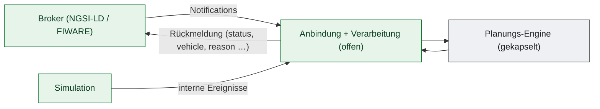

# Eingabe- & Wirkungs-Katalog

> Beschreibt, *welche Eingaben* das System verarbeitet und *welche Wirkung* sie je nach Datenlage/Ist-Zustand auslösen — **nicht** den Lösungsweg. Ergänzt den Vertrag [`IPlanningEngine`](Schnittstelle-IPlanningEngine.md). Leitsatz: **Was & Warum offen — Wie gekapselt.**

## Zwei Eingabekanäle, eine Verarbeitung

---

## 1. Broker-Kanal — Trip-/Vermittlungs-Eingänge

### 1.1 Übersicht

| Auslöser (Entity/Typ) | Wesentliche Felder | Grundwirkung |
|-----------------------|--------------------|--------------|
| **TripRequest** | `user`, `pickupTime`/`dropoffTime`, `requestedAdults`/`requestedChilds`, `startLocation`/`targetLocation` (Geo), `personalPreferences` (`allowCarpooling`, `toleratedDelayBefore/After`) | Vermittlung → Vorschläge erzeugen |
| **Trip** | `id`, `status`, `user`, `proposal`, `vehicle`, pickup/dropoff (Geo+Zeit), `requestedAdults` | **statusabhängig** (s. 1.3) |
| **TripStatus** | `status` (`Started`/`Completed`/`Canceled`) | Statusübergang einer Fahrt |
| **BookTrip** / **StartTrip** / **CompleteTrip** / **CancelTrip** | jeweilige Trip-/Proposal-Kennung | direkte Aktion (buchen/starten/abschließen/stornieren) |

### 1.2 Fall-Tabelle: TripRequest (Vermittlung)

| Datenlage / Ist-Zustand | Wirkung (beobachtbar) |
|--------------------------|------------------------|
| passende, erreichbare Fahrzeuge mit Energie/Kapazität | 1..n Vorschläge (nach Aufwand vergleichbar), je mit Kennzahl + Fahrgast-Distanz |
| Start/Ziel außerhalb Bediengebiet | leeres Ergebnis + Diagnosegrund (z. B. „außerhalb Bediengebiet") |
| Fahrzeuge vorhanden, aber keines einplanbar (Zeit/Energie/Kapazität) | leeres Ergebnis + Ausschlussgründe |
| `allowCarpooling = false` | nur Vorschläge ohne Mitnahme anderer |
| Route nicht fahrbar / Zielzeit nicht haltbar | leeres Ergebnis + Diagnosegrund |

### 1.3 Fall-Tabelle: Trip (statusgetrieben)

| Eingang (Status + Bezug) | Ist-Zustand | Wirkung |
|--------------------------|-------------|---------|
| `Unplanned` **+** `proposal` **+** `user` | Proposal noch im Cache | Buchung → Fahrt geplant, Fahrzeug zugeordnet; **Rückmeldung an Trip: `status=Planned` + `vehicle`** |
| `Unplanned` + `proposal` | Proposal abgelaufen/unbekannt | Buchung scheitert → **Rückmeldung `status=Error`** |
| `Cancelled` / `Canceled` | Fahrt existiert | Stornierung + Ressourcenfreigabe |
| anderer/kein Buchungsbezug | gültige Geo-/Pflichtfelder | Trip wird angelegt |
| anderer/kein Buchungsbezug | ungültig (z. B. Geo fehlt) | **Rückmeldung `status=Error`** |

> Schreibweise: `Cancelled` (kanonisch) **und** `Canceled` (Legacy) werden akzeptiert. Eingehende Statusfelder dürfen flach (`"status":"Unplanned"`) oder als NGSI-LD-Property kommen.

### 1.4 Fall-Tabelle: TripStatus

| Eingang | Ist-Zustand | Wirkung |
|---------|-------------|---------|
| `Started` | Fahrt geplant | Fahrt auf „gestartet" |
| `Completed` | Fahrt gestartet | Fahrt abgeschlossen |
| `Canceled`/`Cancelled` | Fahrt existiert | Fahrt storniert |
| unbekannter Status | — | keine Änderung + Hinweis an den Broker |

---

## 2. Broker-Kanal — Stammdaten & Flottenzustand

Diese Eingänge **aktualisieren den Zustand** (Upsert), gegen den geplant wird; sie erzeugen i. d. R. keine Vorschläge. Wirkung je nach Datenlage:

| Auslöser | Wesentliche Felder | Wirkung |
|----------|--------------------|---------|
| **Cab** (Fahrzeug) | `location`, Energie (`batteryLevel`/`remainingRange`/`consumedEnergy` …), `stateOfSchedule`, Kapazitäten (`seats`/`childSeats`/`luggage`), Kopplung (`stateCoupling`/`chainedVehicles`) | Fahrzeugzustand aktualisieren; **`stateOfSchedule → OutOfService` löst Umplanung/Rettung der betroffenen Fahrten aus** |
| **Pro** (Zugfahrzeug) | analog Fahrzeug + Wasserstoff-/Kopplungsfelder | Pro-Zustand aktualisieren |
| **ChargingPoint** | Kennung, Ort, Typ | Ladepunkt anlegen/aktualisieren |
| **ChainRoute** / **ChainRouteSchedule** / **ChainingLocation** | Start/Ziel, Zeiten, Segmente | Kopplungs-Stammdaten/-fahrplan aktualisieren |
| **AccessPoint** | Ort | Zugangspunkt aktualisieren |
| **CreateCabSchedule** / **CabScheduleUpdated** | Fahrplan-/Schichtdaten | Cab-Fahrplan anlegen/aktualisieren |

> Reine Status-Updates (nur Position/Energie) ohne Kapazitätsfelder dürfen die hinterlegten Kapazitäten **nicht** überschreiben (nullable-Semantik).

---

## 3. Störungs-/Ereignis-Eingänge

| Auslöser | Quelle | Wirkung |
|----------|--------|---------|
| **VehicleDisruptionHandled** | Broker/Event | nachgelagerter Sync der betroffenen Fahrzeuge |
| **ProArrivedAtChainingLocation** | Broker/Event | Fortschritt am Kopplungspunkt verbuchen |
| **PickupDelay** (erkannt) | intern (Stop-Status) | Verspätung prüfen; bei Überschreiten der Toleranz Umplanung anstoßen |

---

## 4. Simulations-Kanal

Die Simulation erzeugt **dieselben Wirkungsklassen** intern, ohne Broker:

| Auslöser (intern) | Wirkung |
|-------------------|---------|
| Fahrtanfrage (simuliert) | wie 1.2 (Vermittlung) |
| Buchung (simuliert) | wie 1.3 (Planung + Zuordnung) |
| **Fahrzeugausfall** | Umplanung/Rettung betroffener Fahrten (wie Cab→OutOfService) |
| **Pickup-Verspätung** | Umplanung wie 3 |
| Zeitfortschritt / Stop erreicht | Fortschreiben von Ankunft/Abfahrt, Energie, Position |

---

## 5. Diagnose-Signale (externe Sichtbarmachung der Fälle)

Die Fälle aus 1–4 werden nach außen über stabile Signale nachvollziehbar gemacht — ohne den Lösungsweg offenzulegen:

- **`status`** am Trip: `Planned` (gebucht), `Error` (Buchung/Anlage gescheitert), `Started`/`Completed`/`Cancelled`.
- **`vehicle`** am Trip: zugeordnete Fahrzeug-URN bei erfolgreicher Buchung.
- **`reason`/Diagnosegrund** am Vorschlags-Ergebnis: warum leer (außerhalb Gebiet, keine geeigneten Fahrzeuge, keine Einplanung möglich).
- **`efficiency`** + Fahrgast-Distanz je Vorschlag: relative Eignung (kein Preis).

---

## 6. Bewusst NICHT spezifiziert (das Wie)

Welcher Vorschlag der „beste" ist, wie Fahrzeuge/Konvois/Ladestopps ausgewählt und bewertet werden, wie Umplanungen entschieden werden, wie die Aufwandskennzahl berechnet wird. Dies liegt vollständig in der gekapselten Engine.

## 7. Weiterführend

- [Schnittstelle-IPlanningEngine.md](Schnittstelle-IPlanningEngine.md) — der zentrale Vertrag.
- [Konformitaets-Testkatalog.md](Konformitaets-Testkatalog.md) — die Wirkungen der Vermittlung (1.2) sind dort ausführbar gegen `IPlanningEngine` prüfbar; die übrigen Wirkungen betreffen die Anbindung und sind im Katalog als solche gekennzeichnet.
