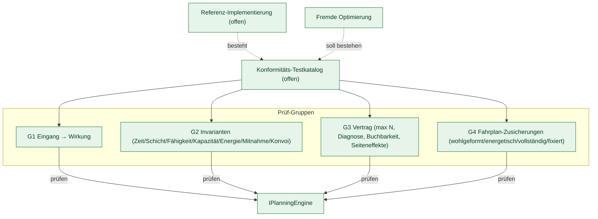

# Konformitäts-Testkatalog

> **Status: ausführbar für `IPlanningEngine`.** Die Prüfgruppen G1 bis G4 sind als Testsuite umgesetzt
> (Projekt `Nemobil.Planning.Conformance`) und laufen gegen jede beliebige Implementierung von
> [`IPlanningEngine`](Schnittstelle-IPlanningEngine.md). Die offene Referenz-Implementierung
> (`Nemobil.Planning.Reference`) besteht die Suite vollständig. Nicht ausführbar sind die Fälle, die das
> Verhalten der Anbindung selbst betreffen (Buchung, Storno, Statuswechsel, Störung) — sie sind unten
> gekennzeichnet.

> Leitsatz: **Was & Warum offen — Wie gekapselt.** Der Katalog beschreibt Prüfungen auf **beobachtbarem Verhalten**, nicht auf internen Erwartungswerten.

## 1. Zweck (Was) & Begründung (Warum)

**Was:** Eine **offene, ausführbare Konformitäts-Suite** gegen den `IPlanningEngine`-Vertrag, abgeleitet aus dem [Eingabe-/Wirkungs-Katalog](Eingabe-Wirkungs-Katalog.md), mit mitgelieferten synthetischen Prüffällen.

**Warum:** Verschiedene Optimierungsverfahren sollen sich gegen dieselbe Schnittstelle prüfen lassen. Eine eigene Optimierung gilt als konform zu diesem Katalog, wenn sie die Suite besteht — ohne dass der interne Lösungsweg offengelegt werden muss.



## 2. Verwendung

Eine eigene Implementierung wird geprüft, indem man in einem xUnit-Testprojekt von der Suite ableitet:

```csharp
public sealed class MeineEngineConformanceTests : PlanningEngineConformanceTests
{
    protected override IPlanningEngine CreateEngine() => new MeineEngine();
}
```

Jede Prüfgruppe läuft dann einmal je Prüffall. Ein roter Test nennt die Verstöße im Klartext, z. B.
`[G2-Zeitfenster] Vorschlag 1, Fahrplan tour-1, Halt g1-01_Pickup: Bedienbeginn 08:25:00 außerhalb [08:00:00, 08:20:00]`.

- **Prüffälle:** `Fixtures/*.json` im Projekt der Suite, ein Fall je Datei, im Format des neutralen
  Vertrags (camelCase). Eigene Fälle im selben Format lassen sich mit `ConformanceScenarios.Parse` laden.
- **Zeitbezug:** alle Fälle liegen auf einem nominalen Tag (7. Januar 2030, UTC). Eine Implementierung,
  die nicht in der Vergangenheit plant, verschiebt sie über `ScenarioDay` auf einen anderen Tag.
- **Einzelne Regeln:** `ConformanceChecks` stellt jede Prüfregel als Funktion bereit, etwa für eigene
  Testfälle oder eine Prüfung im Betrieb.
- **Toleranzen:** Zeitvergleiche gegen Fenster, Schicht und Fahrzeit erlauben 60 Sekunden, Energiebilanzen
  1 Wh Rundungsabweichung. Exakt verglichen werden die Reihenfolge Ankunft ≤ Bedienbeginn ≤ Abfahrt
  innerhalb eines Halts und die Zeiten fixierter Halte.
- **Energie:** Führt ein Fahrzeug keine Batteriekapazität (`EnergyCapacityWh` ≤ 0), entfallen für dieses
  Fahrzeug `[G2-Energie]` und `[G4-Energie]`.

## 3. Prüf-Gruppen

### G1 — Eingang → Wirkung (aus dem Eingabe-/Wirkungs-Katalog)

Je Auslöser × Datenlage wird die **erwartete Wirkungsart** geprüft, nicht der konkrete interne Wert.

| Testfall | Erwartung | Prüffall |
|----------|-----------|----------|
| Fahrtanfrage, passende erreichbare Flotte | ≥ 1 Vorschlag | G1-01, G1-02, G2-04, G4-01, G4-02 |
| Fahrtanfrage, erster einzuplanender Halt außerhalb des Suchradius aller Fahrzeuge (`MaxSearchRadiusMeters`) | leeres Ergebnis **+** Diagnosegrund | G1-03 |
| Fahrtanfrage, Fahrzeuge vorhanden, aber keines einplanbar (Schicht) | leeres Ergebnis **+** Diagnosegrund | G1-04 |
| Fahrtanfrage, `AllowCarpooling = false` | kein Vorschlag mit Mitnahme anderer (geprüft in G2) | G1-05 |
| Fahrtanfrage mit mehreren Einstiegen und Reihenfolge-Vorgaben | ≥ 1 Vorschlag, Reihenfolge eingehalten (G2) | G1-06 |
| Fahrtanfrage, Kapazität reicht bei keinem Fahrzeug | leeres Ergebnis **+** Diagnosegrund | G2-01 |
| Fahrtanfrage, Energie reicht nicht | leeres Ergebnis **+** Diagnosegrund | G2-03 |
| Fahrtanfrage mit benötigter Fähigkeit, nur ein entferntes Fahrzeug führt sie | ≥ 1 Vorschlag, nur auf passendem Fahrzeug (G2) | G2-05 |
| Leerer Flottenzustand | leeres Ergebnis **+** Diagnosegrund | G3-01 |

**Fälle der Anbindung (nicht gegen `IPlanningEngine` prüfbar):** Diese Wirkungen entstehen in der
Anbindungsschicht, nicht in der Planung. Sie sind im Eingabe-/Wirkungs-Katalog beschrieben; eine
ausführbare Prüfung setzt die Anbindung selbst voraus und ist nicht Teil dieser Suite.

| Testfall | Erwartung |
|----------|-----------|
| Trip `Unplanned` + gültiges Proposal | Buchung; Rückmeldung `status=Planned` **+** `vehicle` gesetzt |
| Trip `Unplanned` + abgelaufenes Proposal | Rückmeldung `status=Error` |
| Trip `Cancelled` / `Canceled` | Stornierung + Freigabe |
| TripStatus `Started`/`Completed` (passender Zustand) | Statusübergang |
| Cab `stateOfSchedule=OutOfService` mit laufender Fahrt | Umplanung/Rettung angestoßen |

### G2 — Invarianten (für jeden zurückgegebenen Vorschlag)

| Regel | Prüfung |
|-------|---------|
| `[G2-Zeitfenster]` | Bedienbeginn jedes Halts liegt im Zeitfenster **der Eingabe** (einzuplanender Halt bzw. bestehender Halt), einschließlich Toleranz. Ein im Ergebnis erweitertes Fenster zählt nicht. |
| `[G2-Schicht]` | Jeder Halt liegt innerhalb der Schicht des Fahrzeugs. |
| `[G2-Fähigkeit]` | Jede Fähigkeit, die ein einzuplanender Halt verlangt, führt das Fahrzeug seines Fahrplans. |
| `[G2-Kapazität]` | Die Belegung (Einstieg belegt, Ausstieg gibt frei; Werte aus der Eingabe) überschreitet nach keinem Halt die Kapazität des Fahrzeugs. |
| `[G2-Energie]` | Restenergie bleibt zwischen 0 und der Batteriekapazität. |
| `[G2-Reihenfolge]` | Jeder einzuplanende Halt liegt hinter allen seinen Vorgängern. |
| `[G2-Mitnahme]` | Bei `AllowCarpooling = false`: beim Einstieg ist kein weiterer Fahrgast an Bord, und bis zum Ausstieg steigt niemand zu. |
| `[G2-Konvoi]` | Koppel- und Entkoppel-Halte treten paarweise und in dieser Reihenfolge auf. |

### G3 — Vertrag

| Regel | Prüfung |
|-------|---------|
| `[G3-Obergrenze]` | Höchstens die angefragte Anzahl Vorschläge. |
| `[G3-Diagnose]` | Ein leeres Ergebnis trägt **immer** einen Diagnosegrund. |
| `[G3-Erfolg]` | Wer Vorschläge liefert, meldet den Lauf als erfolgreich. |
| `[G3-Kennzahl]` | Aufwandskennzahl ist eine endliche Zahl (also sortierbar); Fahrgast-Distanz ist ≥ 0. |
| `[G3-Bezug]` | `VehicleId` und `TourId` bezeichnen dieselbe Schicht des Flottenzustands. |
| `[G3-Fahrplan]` | Mindestens ein Fahrplan; `Schedules[0]` gehört zur gebuchten Schicht; jeder Fahrplan gehört zu einer Schicht des Flottenzustands. |
| `[G3-Buchbarkeit]` | Jeder einzuplanende Halt kommt genau einmal vor. Einstiegs- und Ausstiegs-Schlüssel sowie beide zugesagten Zeitfenster sind gesetzt, und die geplanten Zeiten liegen in den zugesagten Fenstern. Der Einstieg liegt vor dem Ausstieg. |
| `[G3-Halt-Art]` | Keine Halt-Art, die ein Aufrufer nicht anwenden kann (`None`, `Parking`, `BusinessTrip`). |
| `[G3-Seiteneffekt]` | Die übergebenen Eingaben sind nach dem Aufruf unverändert. |

**Warum `[G3-Buchbarkeit]` und `[G3-Halt-Art]`:** Der Vertrag führt die zugesagten Zeitfenster und die
Halt-Schlüssel technisch als optional, und das Aufzählungsfeld der Halt-Arten kennt Werte, die ein
Aufrufer nicht übernehmen kann. Ein Vorschlag, der hier abweicht, ist formal vertragskonform, lässt sich
aber nicht buchen. Die Suite macht diese faktischen Anforderungen deshalb prüfbar.

### G4 — Zusicherungen je Fahrplan (`Schedules`)

| Regel | Prüfung |
|-------|---------|
| `[G4-Wohlgeformt]` | Schlüssel eindeutig; `Order` streng steigend; je Halt Ankunft ≤ Bedienbeginn ≤ Abfahrt; Ankunft nicht vor Abfahrt am Vorgänger plus Fahrzeit; keine negativen Strecken oder Zeiten; Depot-Halte nur am Anfang oder Ende. |
| `[G4-Energie]` | Restenergie ergibt sich vorwärts aus Vorgänger minus Verbrauch; ein Anstieg nur an einem Lade- oder Konvoi-Halt und höchstens um die geladene Energie. |
| `[G4-Vollständig]` | Jeder bestehende Fahrgast- und Depot-Halt des Fahrzeugs ist im gelieferten Fahrplan enthalten — der Fahrplan beschreibt den Stand **nach** Annahme, kein Delta. |
| `[G4-Fixiert]` | Unveränderliche Halte (siehe `VehicleState.LastFixedStopKey` und `AvailableFrom`) stehen unverändert am Anfang; kein einzuplanender Halt steht davor. |

Die Diagnosefähigkeit (leeres Ergebnis immer mit Diagnosegrund) prüft `[G3-Diagnose]`.

### Bewusst NICHT im Katalog (das Wie)

Konkrete Heuristik-Ergebnisse, exakte Kennzahl-Werte, *welches* Fahrzeug gewählt wird, interne Schrittfolge, Konvoi-/Energie-/Reassignment-Verfahren. Solche Erwartungswerte sind nicht Teil der Konformität — sie liegen in der jeweiligen Implementierung.

## 4. Prüffälle

Alle Prüffälle sind **synthetisch** und frei erfunden: ein fiktives Bediengebiet, fiktive Fahrzeuge
und Fahrtwünsche. Sie stammen nicht aus einem Betrieb oder einem Datensatz Dritter.

| Kennung | Kurzname | Erwartung |
|---------|----------|-----------|
| G1-01 | erreichbare-flotte | ≥ 1 Vorschlag |
| G1-02 | flotte-mit-obergrenze | ≥ 1 Vorschlag, höchstens 2 |
| G1-03 | ausserhalb-bediengebiet | kein Vorschlag + Diagnose |
| G1-04 | keine-schicht-verfuegbar | kein Vorschlag + Diagnose |
| G1-05 | keine-mitnahme | ≥ 1 Vorschlag ohne Mitnahme |
| G1-06 | mehrere-einstiege | ≥ 1 Vorschlag in Vorgänger-Reihenfolge |
| G2-01 | kapazitaet-ueberschritten | kein Vorschlag + Diagnose |
| G2-02 | geteilte-fahrt-kapazitaet | beliebig; jeder Vorschlag hält die Kapazität ein |
| G2-03 | energie-reicht-nicht | kein Vorschlag + Diagnose |
| G2-04 | enges-zeitfenster | ≥ 1 Vorschlag im Zwei-Minuten-Fenster |
| G2-05 | faehigkeit-erforderlich | ≥ 1 Vorschlag, nur auf dem Fahrzeug mit der Fähigkeit |
| G3-01 | leere-flotte | kein Vorschlag + Diagnose |
| G4-01 | bestehender-fahrplan-vollstaendig | ≥ 1 Vorschlag mit vollständigem Fahrplan |
| G4-02 | fixierte-halte | ≥ 1 Vorschlag, fixierte Halte unverändert |

## 5. Umsetzungsstand

| Prüf-Gruppe | Ausführbare Umsetzung |
|-------------|-----------------------|
| G1 Eingang → Wirkung | umgesetzt für die Planungs-Fälle; Fälle der Anbindung offen (siehe G1) |
| G2 Invarianten | umgesetzt |
| G3 Vertrag | umgesetzt |
| G4 Fahrplan-Zusicherungen | umgesetzt |
| Teil-Schnittstellen (`IChainingService`, `IChargingService`) | offen — nicht Gegenstand der Suite |

**Gegenprobe:** Die Suite prüft sich selbst. Für jede Regel gibt es einen Test, der einen gezielt
eingebauten Verstoß an einem ansonsten konformen Ergebnis erkennen muss; ohne diese Gegenprobe könnte
eine Regel unbemerkt wirkungslos sein.

## 6. Weiterführend

- [Schnittstelle-IPlanningEngine.md](Schnittstelle-IPlanningEngine.md) — der geprüfte Vertrag.
- [Eingabe-Wirkungs-Katalog.md](Eingabe-Wirkungs-Katalog.md) — Quelle der G1-Fälle.
