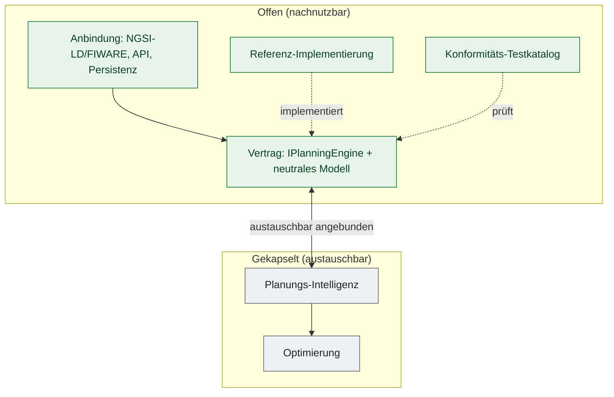

# Architektur: Offene Anbindung, gekapselte Optimierung

> Architektur-Dokumentation der NeMo.bil-Schwarmsteuerung. Beschreibt den Aufbau der **offenen Anbindungsschicht** und ihres Vertrags zur **gekapselten Optimierung**. Teil des NeMo.bil-Anschlusskonzepts (AP 4.3).

## Gestaltungsprinzip

Das System ist von Grund auf in zwei eigenständige Bausteine gegliedert, die über eine klar definierte Schnittstelle zusammenwirken:

- **Anbindungsschicht (offen, nachnutzbar):** standardisierter Datenaustausch mit der Plattform (NGSI-LD/FIWARE), Übersetzung in ein **neutrales Planungsmodell**, Rückgabe der Ergebnisse. Trifft selbst keine Optimierungsentscheidungen.
- **Optimierung & Planungs-Intelligenz (gekapselt, austauschbar):** Zuordnung, Konvoibildung, Routen-/Energie-/Einsatzplanung. Ausschließlich über die Schnittstelle ansprechbar.

## Leitprinzipien

- **Was & Warum offen — Wie gekapselt.** Die Schnittstelle beschreibt, *was* ein- und ausgeht und *warum* — der interne Lösungsweg (*wie*) liegt in der Verantwortung des jeweiligen Optimierungsanbieters.
- **Vertrag statt Kopplung.** Die Anbindung kennt nur das Interface `IPlanningEngine` und ein neutrales Modell; die Optimierung ist dahinter austauschbar.
- **Prüfbarkeit.** Ein offener Konformitäts-Testkatalog benennt die Fälle, gegen die der Vertrag zu prüfen ist — damit sich verschiedene Optimierungsverfahren an derselben Schnittstelle vergleichen lassen.

## Stand der Umsetzung

Umgesetzt sind der **Vertrag** mit neutraler Ein- und Ausgabeseite (`Nemobil.Planning.Contracts`), eine
**offene Referenz-Implementierung** (`Nemobil.Planning.Reference`) und die **ausführbare
Konformitätssuite** mit synthetischen Prüffällen (`Nemobil.Planning.Conformance`). Diese drei Bausteine
bilden den offenen Teil. Eine fremde Optimierung lässt sich damit allein aus dem Vertrag heraus
entwickeln und gegen den Katalog prüfen.

Von der **Anbindungsschicht** gehört das NGSI-LD-Datenmodell zum offenen Teil (`Broker.Contracts`).
Noch nicht Teil der Veröffentlichung ist ihre Logik (NGSI-LD/FIWARE-Adapter, API, Persistenz). Ihr
Verhalten ist im [Eingabe-/Wirkungs-Katalog](Eingabe-Wirkungs-Katalog.md)
beschrieben; die Fälle, die nur die Anbindung prüfen kann (Buchung, Storno, Statuswechsel, Störung), sind
im Testkatalog als solche gekennzeichnet. Die Teil-Schnittstellen `IChainingService` und `IChargingService` sind nur beschrieben: ihr
Code ist nicht enthalten, und die Suite prüft sie nicht.

## Dokumente (Lesereihenfolge)

| # | Dokument | Inhalt |
|---|----------|--------|
| 1 | [Schnittstelle-IPlanningEngine.md](Schnittstelle-IPlanningEngine.md) | Der zentrale Vertrag: neutrale Ein-/Ausgaben, Ports, Zusicherungen, Ablauf. |
| 2 | [Schnittstellen-Teilinterfaces.md](Schnittstellen-Teilinterfaces.md) | Fachliche Teil-Schnittstellen mit gekapselter Implementierung: `IChainingService`, `IChargingService`. |
| 3 | [Eingabe-Wirkungs-Katalog.md](Eingabe-Wirkungs-Katalog.md) | Eingaben beider Kanäle (Broker + Simulation) und ihre zustandsabhängigen Wirkungen. |
| 4 | [Konformitaets-Testkatalog.md](Konformitaets-Testkatalog.md) | Prüfbarkeit des Vertrags und Aufbau des Testkatalogs. |

## Konventionen

- Diagramme als **Mermaid** in den `.md`-Dateien.
- Begriffe: „Teilstrecke" (Routing-Segment), „Cab"/„Pro" (Fahrzeugtypen), „Konvoi" (gekoppelte Cabs an einem Pro).
