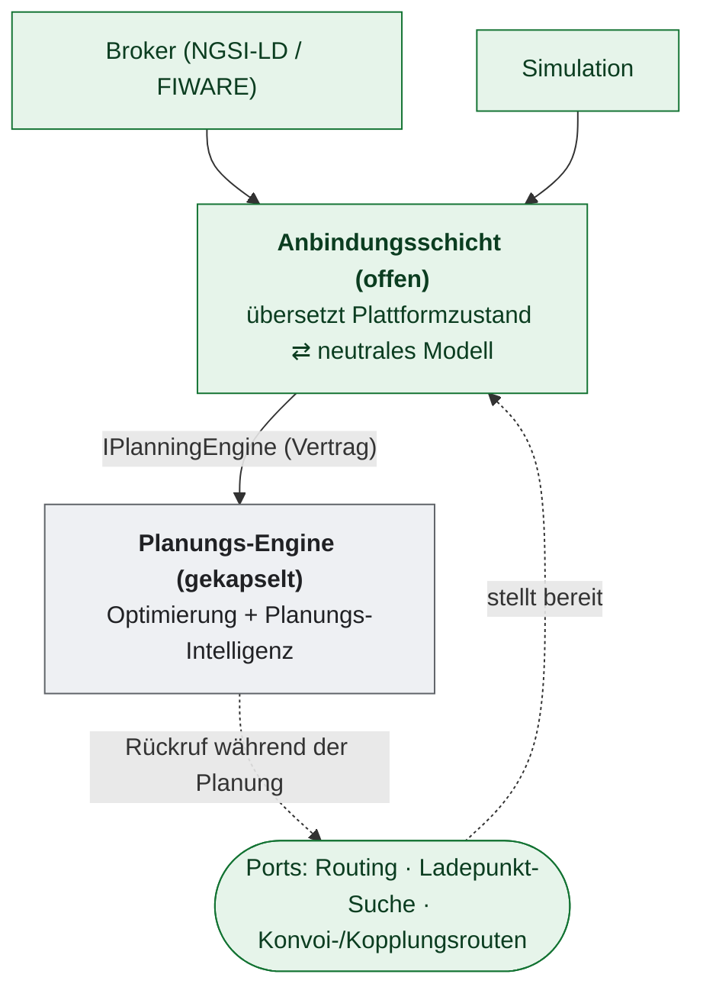
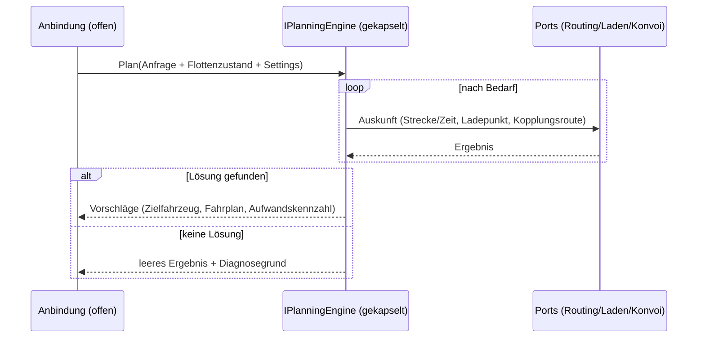

# Schnittstelle `IPlanningEngine`

> Der zentrale Vertrag zwischen der offenen Anbindungsschicht und der gekapselten Optimierung. Leitsatz: **Was & Warum offen — Wie gekapselt.**

## 1. Zweck (Was) und Begründung (Warum)

**Was:** `IPlanningEngine` ist die einzige Schnittstelle, über die die offene Anbindungsschicht die gekapselte Planung anspricht. Sie nimmt einen **neutralen Plattformzustand** plus eine **Planungsanfrage** entgegen und liefert **Planungsergebnisse** (Vorschläge bzw. Fahrpläne) zurück.

**Warum:** Die Trennung erlaubt, die Optimierung auszutauschen und unabhängig weiterzuentwickeln, ohne die Anbindung anzufassen. Dritte können eine **eigene** Optimierung gegen denselben Vertrag bauen. Die Anbindung trifft selbst keine Optimierungsentscheidungen; sie übersetzt nur Plattformzustand ⇄ neutrales Modell.

## 2. Position im System

Ablauf eines Planungsaufrufs (das **Was** des Zusammenspiels):

## 3. Eingaben

Alle Eingaben sind **neutral** und vollständig aus dem Vertrag lesbar. Eine Implementierung braucht
keine Kenntnis der internen Repräsentation der Anbindung. Mit `FleetSnapshot` und `PlanningItemList`
liefert der Vertrag offene Standard-Implementierungen, sodass sich Eingaben auch ohne die Anbindung
aufbauen lassen (so arbeiten die Prüffälle der Konformitätssuite).

| Block | Inhalt (Was) | Bedeutung / Warum |
|-------|--------------|-------------------|
| **Anfrageparameter** (`PlanningRequest`) | Start/Ziel (Geo), Ein-/Ausstiegs-Zeitfenster, Personen-/Gepäck-Kapazitätsbedarf (`CapacityDemand`), Mitnahme erlaubt ja/nein, tolerierte Verspätung, benötigte Eigenschaften (`RequiredSkills`), Zeitbereich, max. Anzahl Vorschläge, Suchradius, Analyse-/Diagnosemodus, Korrelations-ID. | Begrenzt Lösungsraum & Antwortmenge; ID für konkurrierende Anfragen. |
| **Zu planende Elemente** (`IPlanningItems.Items`, je `PlanningItem`) | Je Halt: Schlüssel, Art (Einstieg/Ausstieg), Ort, Zeitfenster, Bedienzeit, Belegung (`Quantities`), benötigte Fähigkeiten, Priorität und die Vorgänger, die vorher bedient sein müssen. Mehrere Ein- oder Ausstiege je Anfrage sind zulässig. | Das, was eingeplant werden soll. Die Schlüssel kehren im Ergebnis unverändert wieder. |
| **Flottenzustand** (`IFleetState.Vehicles`, je `VehicleState`) | Je Schicht: Fahrzeug- und Schicht-Kennung, Schichtzeitraum, aktueller Standort, frühester Planungszeitpunkt, Schlüssel des letzten bereits bedienten Halts, Kapazitäten, Batteriekapazität, Energie zu Planungsbeginn, Richtwert Verbrauch je Meter, Fähigkeiten und der **vollständige Ist-Fahrplan** (`PlannedStop`, dieselbe Struktur wie im Ergebnis). `IFleetState.Tours` ist die kompakte Referenzliste derselben Schichten. | Kontext, in den die Anfrage eingefügt wird. Bereits bediente Halte sind unveränderlich. |
| **Einstellungen** | Planungs-Settings (z. B. Toleranzen, Carpooling an/aus, Service-Parameter). Toleranzen und Carpooling-Schalter liegen im `PlanningRequest`; weitere betreiberspezifische Settings bezieht die Implementierung selbst. | Fachliche Randbedingungen des Betreibers. |
| **Ports (Rückruf-Abhängigkeiten)** | Auskunftsdienste, die eine Implementierung benötigen kann: **Routing** (Strecke/Zeit zwischen Punkten), **Ladepunkt-Suche**, **Konvoi-/Kopplungsrouten-Suche**. | Konstruktor-Injektion, nicht Teil der Aufruf-Signatur. Die Referenz-Implementierung nutzt nur ein austauschbares Streckenmodell. |

### 3.1 Konventionen der Eingabe

- **Belegung:** `Quantities` folgen den Schlüsseln `ADULTS`, `CHILDS`, `LUGGAGE` und `REQUESTS` (siehe
  `PlannedStop.Quantities`). Ein Einstieg belegt, ein Ausstieg gibt frei; über eine Anfrage summieren sich
  Ein- und Ausstiege zu denselben Werten. `VehicleState.Capacity` nennt die Obergrenzen in denselben
  Schlüsseln.
- **Fähigkeiten** werden als numerische Kennungen geführt (`PlanningItem.Skills`, `VehicleState.Skills`,
  `PlannedStop.Skills`). `PlanningRequest.RequiredSkills` nennt dieselben Anforderungen zusätzlich als
  Bezeichner; eine Zuordnung zwischen Bezeichner und Kennung liefert der Vertrag nicht.
- **Energie** in Wattstunden (Wh), Strecken in Metern, Dauern in Sekunden, Zeiten als UTC.
- **Unveränderliche Halte:** der Halt mit `LastFixedStopKey` und alle Halte davor sowie jeder Halt,
  dessen Abfahrt vor `AvailableFrom` liegt. Eine Implementierung übernimmt sie unverändert an den Anfang
  des Fahrplans.

## 4. Ausgaben (neutral)

| Block | Inhalt (Was) |
|-------|--------------|
| **Vorschläge** (0..n) | Je Vorschlag: Zielfahrzeug, ein oder mehrere resultierende Fahrpläne (`Schedules`, siehe unten), **relative Aufwandskennzahl** (Maß, wie gut die Anfrage in die Flotte passt — kein Preis, keine absolute Größe), Fahrgast-Distanz. |
| **Ausschlüsse** (`Exclusions`) | Gründe, aus denen Fahrzeuge bzw. Einfügungen nicht in Frage kamen — je Eintrag ein Grund und eine optionale Erläuterung. |
| **Diagnose** | Bei leerem Ergebnis: nachvollziehbarer Grund/Status (z. B. außerhalb Bediengebiet, keine geeigneten Fahrzeuge, keine Einplanung möglich). |

### 4.1 Der Fahrplan (`Schedules`/`PlannedStop`/`PlannedStopKind`)

Ein Vorschlag trägt seine Fahrpläne als `Schedules` — eine Liste, weil eine Anfrage
mehr als ein Fahrzeug betreffen kann (z. B. Konvoi). **`Schedules[0]` ist immer der
Fahrplan des Fahrzeugs, auf das gebucht wird**; weitere Einträge betreffen mitgeplante
Fahrzeuge. Jeder Fahrplan (`PlannedSchedule`) ist eine geordnete Liste von Halten
(`PlannedStop`). Ein Halt trägt Ort, Position, Art (`PlannedStopKind`), Korrelations-
schlüssel, Zeiten (Ankunft/Bedienbeginn/Abfahrt), Aufwände (Fahrzeit, Distanz),
Energiewirkung (Verbrauch, Ladung, Restenergie) sowie die fachlichen Bezüge
(Zeitfenster, Fähigkeiten, Kapazitätsangaben, Priorität) — alles, was ein Aufrufer
braucht, um den Halt ohne Kenntnis der Optimierung auf seinen Ist-Zustand anzuwenden.

`PlannedStopKind` benennt die gängigen Halt-Arten (Pickup, Dropoff, Charging, Depot,
Chaining/Unchaining, …). Ein Halt, dessen Art der Vertrag nicht eigens benennt, trägt
`Other` — der Aufrufer korreliert ihn ausschließlich über den Schlüssel mit einem
bereits bestehenden Halt und aktualisiert dessen Werte; er legt ihn **nicht** neu an
(die Art wäre geraten) und lässt ihn ohne Treffer weg.

## 5. Zusicherungen / Nachbedingungen

- Zurückgegebene Vorschläge verletzen **keine** harten Randbedingungen (Kapazität, Zeitfenster, Energie/Reichweite, Konvoi-Regeln).
- Vorschläge sind nach **relativem Aufwand** vergleichbar/sortierbar (niedriger = besser passend).
- Maximal die angefragte Zahl an Vorschlägen.
- Leeres Ergebnis ist ein **gültiges** Ergebnis und wird mit Diagnosegrund versehen (kein stiller Fehler).
- Der Aufruf ist bezüglich des übergebenen Zustands seiteneffektfrei (die Anbindung entscheidet über Persistenz/Buchung).

### 5.1 Zusicherungen je Fahrplan

Jeder in `Schedules` zurückgegebene Fahrplan ist:

1. **wohlgeformt** — Schlüssel (`Key`) sind innerhalb des Fahrplans eindeutig; die
   Halte sind chronologisch geordnet (`Order` und Zeit); ein Depot-Start steht am
   Anfang und ein Depot-Ende am Ende, sofern der Fahrplan sie liefert. **Warum:**
   ein Aufrufer muss den Fahrplan ohne eigene Plausibilisierung übernehmen können.
2. **energetisch konsistent** — `RemainingEnergy` ergibt sich vorwärts aus
   `ConsumedEnergy`/`ChargedEnergy`; kein Anstieg ohne Lade- oder Konvoi-Halt.
   **Warum:** ein Aufrufer, der Reichweite/Ladebedarf aus dem Fahrplan ableitet, muss
   sich auf einen physikalisch plausiblen Verlauf verlassen können.
3. **vollständig** — er beschreibt den Fahrplan des Fahrzeugs **nach** Annahme des
   Vorschlags, nicht ein Delta zum bisherigen Stand. **Warum:** der Aufrufer ersetzt
   seinen Ist-Zustand durch den gelieferten Fahrplan, statt ihn zu patchen.
4. **diagnosefähig** — ein leeres Ergebnis ist gültig und trägt stets einen
   Diagnosegrund. **Warum:** „keine Lösung" muss vom Aufrufer von einem stillen Fehler
   unterscheidbar sein.

Zusätzlich gilt für den Vorschlag als Ganzes: `Schedules[0]` ist der Fahrplan des
Fahrzeugs, auf das gebucht wird.

## 6. Eingabe- & Wirkungs-Katalog

Welche Eingaben es gibt und welche Wirkung sie je nach Datenlage/Ist-Zustand auslösen, ist vollständig im [Eingabe-/Wirkungs-Katalog](Eingabe-Wirkungs-Katalog.md) beschrieben (beide Kanäle: Broker-Notifications und Simulation). Kurzüberblick:

| Auslöser | Datenlage / Ist-Zustand | Wirkung (beobachtbar) |
|----------|--------------------------|------------------------|
| Fahrtanfrage | passende, erreichbare Fahrzeuge mit Energie/Kapazität | ein/mehrere Vorschläge (nach Aufwand vergleichbar), je mit Kennzahl/Distanz |
| Fahrtanfrage | Start/Ziel außerhalb Bediengebiet | leeres Ergebnis + Diagnosegrund |
| Fahrtanfrage | Fahrzeuge da, aber keines einplanbar | leeres Ergebnis + Ausschlussgründe |
| Buchung (Anfrage + gültiger Vorschlagsbezug) | Vorschlag vorhanden/gültig | Fahrt wird gebucht |
| Stornierung | Fahrt existiert | Fahrt storniert + Ressourcen freigegeben |
| Statuswechsel (gestartet/abgeschlossen) | Fahrt im passenden Zustand | Zustandsübergang |
| Störung (z. B. Fahrzeug außer Betrieb) | betroffene Fahrt(en) vorhanden | Umplanung/Rettung der betroffenen Fahrten |

## 7. Bewusst NICHT spezifiziert (das Wie)

Algorithmus, Heuristik, Gewichtungen, Reihenfolge der internen Schritte, Modellbildung (wie der neutrale Zustand intern repräsentiert wird), Berechnung der Aufwandskennzahl, Konvoi-/Energie-/Reassignment-Verfahren. Diese liegen vollständig hinter `IPlanningEngine` und sind austauschbar.

## 8. Prüfbarkeit

Der Vertrag wird durch einen **offenen, ausführbaren Konformitäts-Testkatalog** ergänzt, siehe
[Konformitaets-Testkatalog.md](Konformitaets-Testkatalog.md). Die Suite läuft gegen jede Implementierung
von `IPlanningEngine` und prüft beobachtbares Verhalten und Zusicherungen, **nicht** interne
Erwartungswerte. Die offene Referenz-Implementierung besteht sie vollständig.

Über den Vertragstext hinaus prüft die Suite zwei faktische Anforderungen, ohne die ein Vorschlag nicht
buchbar ist: gesetzte Halt-Schlüssel und zugesagte Zeitfenster für Ein- und Ausstieg (im Vertrag
technisch optional) sowie ausschließlich anwendbare Halt-Arten.

## Weiterführend

- [Schnittstellen-Teilinterfaces.md](Schnittstellen-Teilinterfaces.md) — die fachlichen Teil-Schnittstellen (`IChainingService`, `IChargingService`), die die Engine als Ports nutzt.
- [Eingabe-Wirkungs-Katalog.md](Eingabe-Wirkungs-Katalog.md) — vollständige Eingaben und Wirkungen.
- [Konformitaets-Testkatalog.md](Konformitaets-Testkatalog.md) — Prüfbarkeit des Vertrags.
