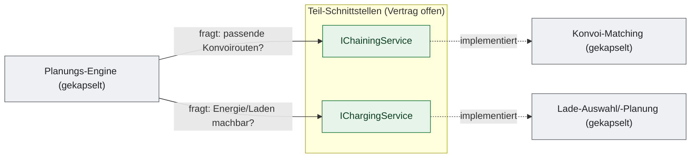

# Teil-Schnittstellen `IChainingService`, `IChargingService`

> Fachliche Teil-Schnittstellen, deren **Vertrag offen** und deren **Implementierung gekapselt** ist. Es gilt derselbe Leitsatz: **Was & Warum offen — Wie gekapselt.**

## Einordnung

Die Planungs-Engine benötigt während der Planung fachliche Auskünfte, die sie nicht selbst löst: „passende Konvoirouten?" und „Energie/Laden machbar?". Diese werden über schmale Schnittstellen bereitgestellt — der **Vertrag** ist offen, **wie** die Antwort zustande kommt (Auswahl, Bewertung, Reihenfolge) ist gekapselt.

> Hinweis: Beschrieben wird der Vertrag dieser Schnittstellen; ihr Code ist nicht Teil der Veröffentlichung. Beide Interfaces enthalten zusätzlich **offene Stammdaten-Verwaltung** (CRUD für Lade­punkte, Kopplungsorte/-routen). Die ist reine Anbindung und hier nicht Gegenstand; beschrieben werden nur die **Auskunfts-/Planungsoperationen** mit gekapselter Logik.

---

## 1. `IChainingService` — passende Konvoirouten finden

**Zweck (Was):** Liefert zu einer Anfrage geeignete **Kopplungsrouten** (ChainRoutes) bzw. zeitlich passende **Kopplungsabschnitte** (ChainRouteSegments) — als Kandidaten für die Bildung eines Konvois (Cab koppelt an ein Zugfahrzeug/Pro).

**Begründung (Warum):** Konvoibildung bündelt Fahrten auf einer gemeinsamen Strecke und spart **Anfahrtswege und Energie**. Die Engine braucht dafür die in Frage kommenden Routen/Abschnitte als Kandidaten.

**Operationen (Vertrag):**
| Operation | Eingaben | Ausgabe |
|-----------|----------|---------|
| `SearchBestMatchingChainRoutesAsync` | Start- + Zielort, Anzahl | bis zu *n* passende Kopplungsrouten |
| `SearchNearbyChainRoutesAsync` | Ort, Umkreis (m), Anzahl | bis zu *n* Kopplungsrouten in der Nähe |
| `SearchBestMatchingChainRouteSegmentsAsync` | Start- + Zielort, **Zeitfenster**, Anzahl | bis zu *n* zeitlich passende Kopplungsabschnitte |

**Zusicherungen:** Es werden höchstens *n* Kandidaten geliefert; bei den Segment-Anfragen liegen die Ergebnisse im angefragten Zeitfenster; keine Treffer ⇒ leere Liste (kein Fehler).

**Determinismus & Nebenwirkungen:** Reine Lese-/Auskunftsoperationen — kein Zustand wird verändert.

**Nicht spezifiziert (Wie):** Welche Routen als „passend" gelten, wie Nähe/Eignung gewichtet und sortiert wird, wie Zeitfenster auf Abschnitte abgebildet werden.

---

## 2. `IChargingService` — Energie-/Ladebedarf prüfen & einplanen

**Zweck (Was):** Findet **Ladepunkte**, prüft deren **Verfügbarkeit** in Zeitfenstern, **plant Ladesessions** für ein Fahrzeug und verwaltet **Belegungen**.

**Begründung (Warum):** Elektrische Cabs müssen rechtzeitig laden. Die Energie-/Ladeprüfung **verhindert Touren, die ein Fahrzeug nicht zu Ende fahren könnte**, und reserviert Ladekapazität konfliktfrei.

**Operationen (Vertrag, Auswahl):**
| Operation | Eingaben | Ausgabe |
|-----------|----------|---------|
| `SearchNextChargingPointsAsync` / `GetNextChargingPointsAsync` | Ort bzw. Kachel, Ladepunkt-Typ | passende Ladepunkte |
| `ChargingPointAvailableAsync` | Ladepunkt, Start/Ende | verfügbar ja/nein |
| `PlanChargingSessionAsync` | Fahrzeug, Ort, Startzeit, **benötigte Energie** | geplante Ladesession (Kennung) |
| `ChargingPointAssignmentsInTimeRangeAsync` | Ladepunkt, Zeitraum | Belegungen im Zeitraum |
| `AddAndGetChargingAssignment` / `DeleteChargingAssignment` | Ladepunkt, Zeitraum, Fahrzeug | Belegung anlegen/entfernen |
| `Start`/`CompleteChargingSessionAsync` | Fahrzeug/Session | Ladevorgang starten/abschließen |

**Zusicherungen:** Verfügbarkeitsprüfungen berücksichtigen bestehende Belegungen; eine geplante Session deckt die angefragte Energiemenge im angegebenen Zeitfenster ab; keine passende Möglichkeit ⇒ leeres Ergebnis bzw. „nicht verfügbar".

**Determinismus & Nebenwirkungen:** Such-/Prüfoperationen sind seiteneffektfrei; `Plan…`, `Add…`, `Delete…`, `Start/Complete…` **ändern Belegungs-/Sessionzustand** (bewusst zustandsverändernd).

**Nicht spezifiziert (Wie):** Auswahl des „besten" Ladepunkts, Berechnung von Ladedauer/-bedarf, Einplanungsstrategie und Konfliktauflösung bei knappen Ladekapazitäten.

---

## Weiterführend

- [Schnittstelle-IPlanningEngine.md](Schnittstelle-IPlanningEngine.md) — der zentrale Vertrag; diese Teil-Schnittstellen sind die „Ports", die die Engine während der Planung nutzt.
- [Konformitaets-Testkatalog.md](Konformitaets-Testkatalog.md) — Prüfbarkeit des Vertrags; die Teil-Schnittstellen sind dort noch nicht Gegenstand der ausführbaren Suite.
